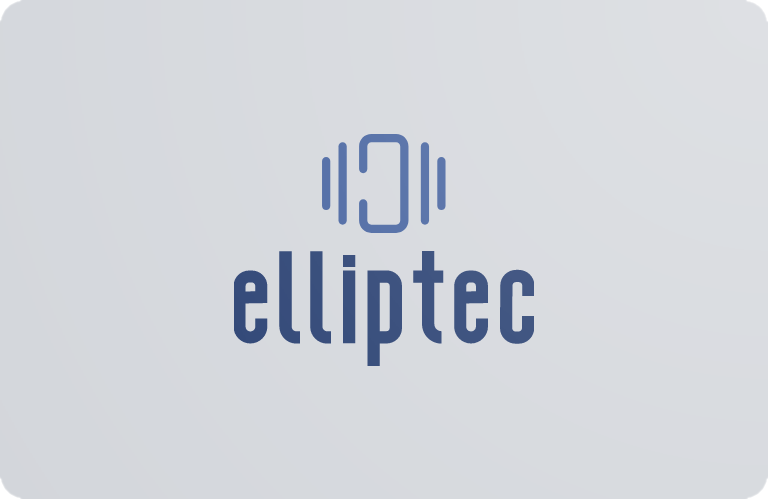

<!-- PROJECT LOGO -->
<br />
<div align="center">
  <a href="https://github.com/roesel/elliptec">
    
  </a>

  <h3 align="center">Elliptec</h3>

  <p align="center">
    Simple control of Thorlabs Elliptec&trade; devices.
    <br />
    <a href="https://elliptec.readthedocs.io/en/latest/"><strong>Explore the docs »</strong></a>
    <br />
    <br />
    <a href="https://github.com/roesel/elliptec">Get started</a>
    ·
    <a href="https://github.com/roesel/elliptec/issues">Report a bug</a>
    ·
    <a href="https://github.com/roesel/elliptec/issues">Request a feature</a>
  </p>
</div>

<!-- ABOUT THE PROJECT -->
## About The Project

ThorLabs Elliptec&trade; devices offer a neat way to quickly set up automated workflows in optical systems. This project aims to provide a simple and quick way to control them directly from Python. It uses the [pyserial](https://github.com/pyserial/pyserial) library and is inspired by the [TL-rotation-control](https://github.com/cdbaird/TL-rotation-control) project by [Chris Baird](https://github.com/cdbaird). The end goal of the project is to reproduce the entire functionality of the official [Elliptec&trade; Software](https://www.thorlabs.com/software_pages/ViewSoftwarePage.cfm?Code=ELL). 

💣 **This library is still under active development. Serious bugs are present and breaking changes will be introduced.** 

## Quickstart
A basic example, which shows how to use a shutter:
```python
import elliptec
controller = elliptec.Controller('COM3')
sh = elliptec.Shutter(controller)
# Get information about the device
info = sh.get('info')
# Home the shutter before usage
sh.home()
# Open shutter, acquire, and close again
sh.open()
# ... acquire or perform other tasks
sh.close()
```

An example using a four-positional slider:
```python
import elliptec
controller = elliptec.Controller('COM3')
sl = elliptec.Slider(controller)
# Home the slider before usage
sl.home()
# Move slider to position 3
sl.set_slot(3)
# Move slider forward (to position 4)
sl.move('forward')
```

An example using a rotator (mount or stage) to collect multiple polarizations/angles:
```python
import elliptec
controller = elliptec.Controller('COM3')
ro = elliptec.Rotator(controller)
# Home the rotator before usage
ro.home()
# Loop over a list of angles and acquire for each
for angle in [0, 45, 90, 135]:
  ro.set_angle(angle)
  # ... acquire or perform other tasks
```

An example using a linear stage to find optimal focus:
```python
import elliptec
controller = elliptec.Controller('COM3')
ls = elliptec.Linear(controller)
# Home the linear stage before usage
ls.home()
# Loop over a list of positions and measure gain for each
for distance in range(0, 61, 10):
  ls.set_distance(distance)
  # ... measure gain
```

## Advanced examples

### Multiple devices

Controlling multiple devices through one ELLB bus is possible. This requires some setup, first. By default, every device has an address of "0", so plugging in multiple devices all have the same address, leading to undefined behavior. In these examples, we'll assume you are combining a shutter and a rotator. First you need to change the addresses of each device independently. This can be done through the [Elliptec&trade; Software](https://www.thorlabs.com/software_pages/ViewSoftwarePage.cfm?Code=ELL), or over serial. For the serial assignment, unplug all but one device

```python
import elliptec
# connect to shutter
controller = elliptec.Controller('COM4')
shutter = elliptec.Shutter(controller)
# change address and save
shutter.change_address("1")
shutter.save_user_data()
```
now, plug in the second device
```python
# connect to rotator
rotator = elliptec.Rotator(controller)
rotator.change_address("2")
rotator.save_user_data()
```

Note, if you do not `save_user_data` the device address will be lost when the device loses power, requiring you to perform these address changes again, which requires plugging the devices in one-by-one, again.

Once the devices have been addressed, you can access them and use them by specifying their address when connecting:
```python
import elliptec
# connect to devices
controller = elliptec.Controller('COM4')
shutter = elliptec.Shutter(controller, address='1')
rotator = elliptec.Rotator(controller, address='2')
# Home the shutter and the rotator
shutter.home() 
rotator.home()
# Loop over a list of angles and opne/acquire/close for each
for angle in [0, 90]:
    rotator.set_angle(angle)
    # Open shutter, acquire, and close again
    shutter.open()
    # ... acquire or perform other tasks
    shutter.close()
```

## List of supported devices
Currently (somewhat) supported devices:
* Dual-Position Slider (ELL6) - [Thorlabs product page](https://www.thorlabs.com/newgrouppage9.cfm?objectgroup_id=9464) - useful as a shutter
* Four-Position Slider (ELL9) - [Thorlabs product page](https://www.thorlabs.com/newgrouppage9.cfm?objectgroup_id=9464) - useful as a filter wheel
* Rotation Mount (ELL14) - [Thorlabs product page](https://www.thorlabs.com/newgrouppage9.cfm?objectgroup_id=12829) - useful for polarization state generators
* Motorized Iris (ELL15) - [Thorlabs product page](https://www.thorlabs.com/newgrouppage9.cfm?objectgroup_id=15837) - useful for aperture control
* Linear Stage (ELL17) - [Thorlabs product page](https://www.thorlabs.com/newgrouppage9.cfm?objectgroup_id=10461) - useful for motorized focusing
* Rotation Stage (ELL18) - [Thorlabs product page](https://www.thorlabs.com/newgrouppage9.cfm?objectgroup_id=10459) - useful for rotating mirrors
* Linear Stage (ELL20) - [Thorlabs product page](https://www.thorlabs.com/newgrouppage9.cfm?objectgroup_id=11736) - useful for motorized focusing

As of right now, I do not have access to any other devices from the Elliptec&trade; family. If you are interested in controlling a device that is not on this list, feel free to reach out to me. Thank you to Thorlabs Inc. for providing me with some of the devices above for testing.

## Untested (but possibly working) devices
These devices have never been tested with this library, but could potentially work with some minor code changes, since they share a design with one of the *somewhat supported* ones:
* Six-Position Slider (ELL12) - [Thorlabs product page](https://www.thorlabs.com/newgrouppage9.cfm?objectgroup_id=9464) - useful as a filter wheel

The same could possibly extend to the discontinued/obsolete devices such as the ELL7, ELL8, and ELL10.

## What works and what doesn't
What works:
* basic movement
* getting information about the device 
* getting information about individual motors
* ability to control multiple devices on one controller via a bus module

What needs improvements:
* documentation
* tests (more devices, more details)
* automated discovery of devices

What is missing:
* safety (no library performed bounds checks etc)
* consistency (across methods, devices, returns, ...)
* adding devices by serial number
* searching for and setting optimal motor frequencies
* cleaning and optimization procedures

Some of the missing functionality can be performed using the official [Elliptec&trade; Software](https://www.thorlabs.com/software_pages/ViewSoftwarePage.cfm?Code=ELL).

## Support
If you are going to use this code in any way, **please let me know** via [email](mailto:roesel@gmail.com)/[twitter](https://twitter.com/DavidRoesel)/[issues](https://github.com/roesel/elliptec/issues) or find my contact info on [my website](https://david.roesel.cz/en/). I am working on this project in my spare time and need every piece of encouragement I can get! If this project was useful to you, please consider buying me a coffee ;).

<a href='https://ko-fi.com/roesel' target='_blank'>

## Disclaimer
Thorlabs&trade; and Elliptec&trade; are registered trademarks of Thorlabs,&nbsp;Inc. This project is fully non-commercial and not affiliated with Thorlabs,&nbsp;Inc. in any capacity. 
